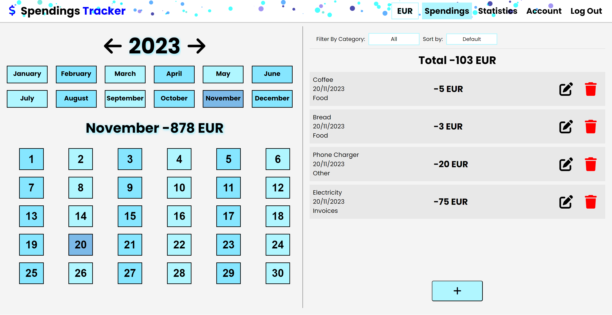
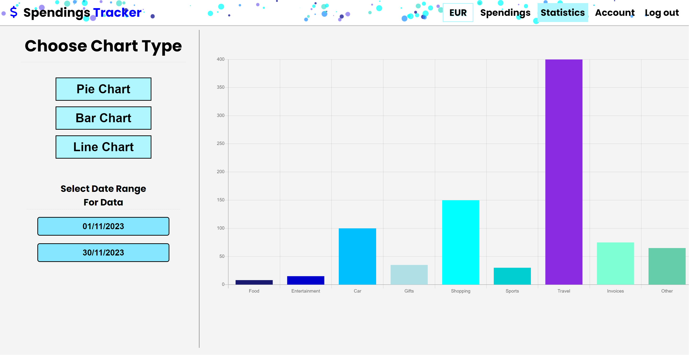
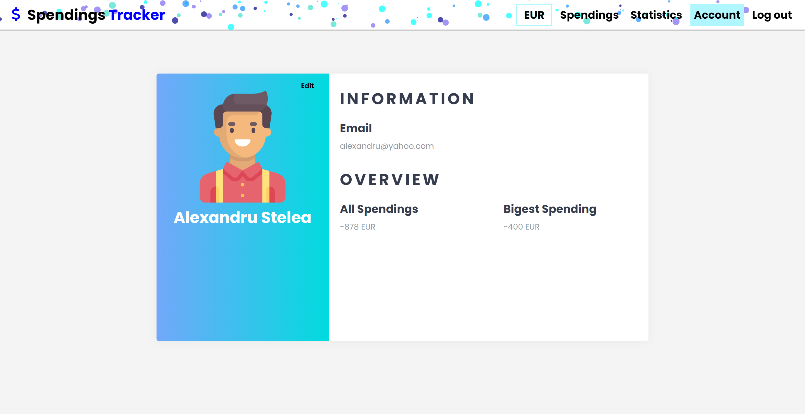
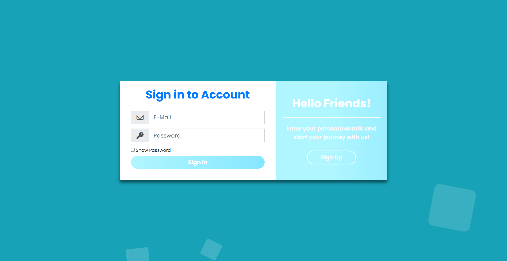

# Spendings Tracker

## Overview

Spendings Tracker is a web application designed to help you manage and track your daily expenses. It offers a range of features to help you keep a close eye on your spending habits, including tracking daily expenses, viewing your spending history, summarizing expenses for the month, supporting multiple currencies with automatic conversion, and providing visual graphs for better insights. Additionally, Spendings Tracker includes user account management with a login system and email verification for secure access.

## Features

### Expense Tracking

- Log your daily expenses with ease.
- View a history of your spending over time.
- Get a monthly summary of your expenses.

### Currency Conversion

- Support for various currencies with automatic conversion.
- Ensure accurate expense tracking when dealing with different currencies.

### Data Visualization

- Visualize your spending habits with interactive graphs.
- Gain insights into your expenses through visual representations.

### User Accounts

- Register and create an account securely.
- Verify your email for account access.
- Log in to access your spending data.

## Screenshots

### Main Page

### Graphs Page

### Account Page

### Login Page

## Getting Started

To get started with Spendings Tracker, follow these steps:

1. **Clone the repository** to your local machine.
2. **Install PostgreSQL** and create a database named "SpendingsTracker."
3. **Set up your environment variables** by creating a `.env` file in the project backend directory. Add the following:

- `HOSTNAME = <your_host_name>`
- `DB_NAME = "SpendingsTracker"`
- `PG_USER = "<your_postgre_user>"`
- `PG_PASSWORD = <your_postgre_password>`
- `PG_PORT = <your_postgre_port>`
- `FLASK_SECRET = <secret_for_flask_app>`

4. Install Python and the required Python packages using `pip install -r requirements.txt`.
5. Run the Flask application with `python main.py`.

## Technologies Used

- **Python** with **Flask framework** for the backend.
- **HTML**, **CSS**, and **JavaScript** for the frontend.
- **PostgreSQL** for the database.

## Authors

The project was conceptualized and developed by:

- [Alexandru-Vasile Stelea](https://www.linkedin.com/in/alexandrustelea)
- [Andrei-Cristian Sava](https://www.linkedin.com/in/cristianandreisava)
- [Radu Tanase](https://www.linkedin.com/in/tanase-radu-9a7296209/)
